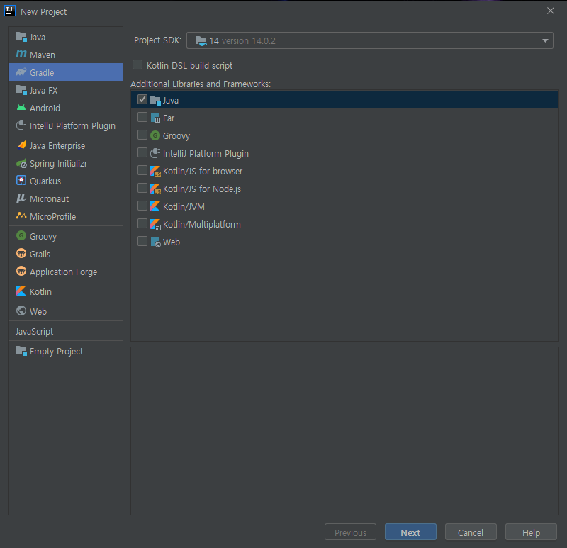
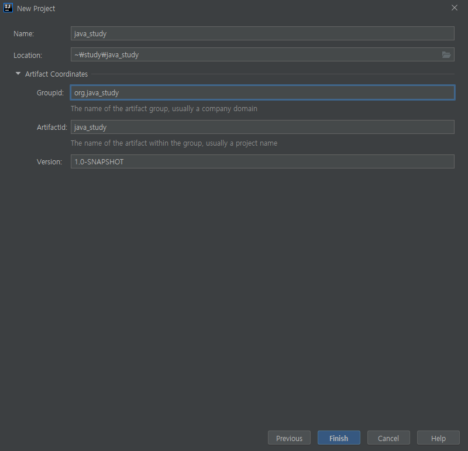
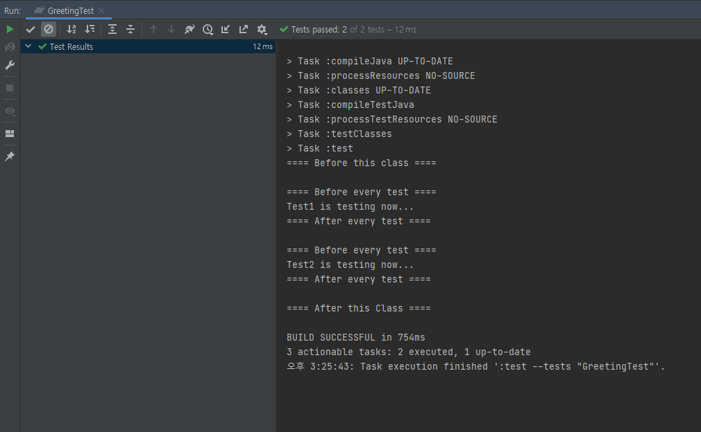

# IntelliJ에서 JUnit으로 테스트코드 만들어보기

## 1. 프로젝트 생성 시 Gradle을 선택하여 의존성 관리를 하자.

## 2. groupid와 artifactid는 원하는 식별자를 입력하자(실제 프로젝트라면 룰에 맞춰야 함)

## 3. 프로젝트 생성 완료

## 4. 테스트를 위한 간단한 예시 코드 작성

## 5. 테스트 코드 작성

## 6. 테스트 결과

테스트에 이상이 없다면, 다음과 같이 Gradle에서 초록색 표시와 함께 정상적인 테스트 결과가 나오게 된다.

--------------------------------------------------------------------------------

더 자세한 내용 정리

[더 자세한 내용 정리](https://blog.naver.com/songs4805/222218282692)