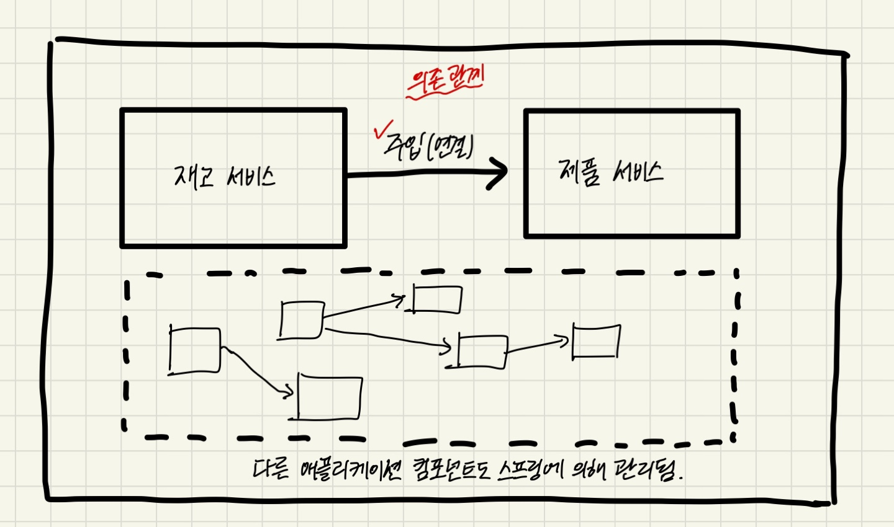
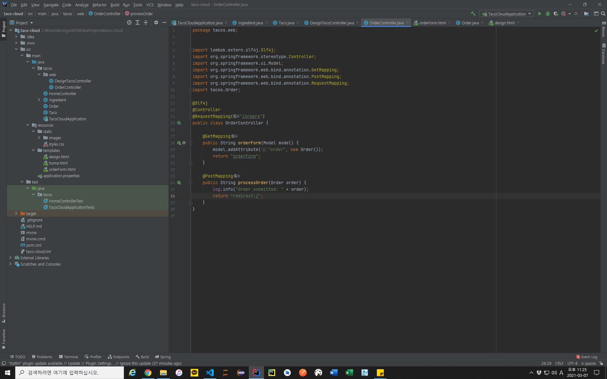

# 스프링이란?
> 스프링은 Spring application context라는 컨테이너(container)를 제공하는데, 이것은 애플리케이션 컴포넌트들을 생성하고 관리한다. 애플리케이션 컴포넌트 또는 빈(bean)들은 스프링 애플리케이션 컨텍스트 내부에서 서로 연결되어 완전한 애플리케이션을 만든다.
>
> 책에서 비유하길, 벽돌, 목재, 못, 배관, 배선이 함께 어우러져 집을 구성하는 것과 비슷하다고 한다.
>
> 다음 그림을 보며 구조를 이해하자.
>
> 
>
> 빈의 상호 연결은 의존성 주입(Dependency Injection, DI)이라고 알려진 패턴을 기반으로 수행된다. 애플리케이션 컴포턴트에서 의존하는 다른 빈의 생성과 관리를 자체적으로 하는 대신 별도의 개체(컨테이너)가 해주며, 이 개체에서는 모든 컴포넌트를 생성, 관리하고 해당 컴포넌트를 필요로 하는 빈에 주입(연결)한다.
>


```java
@Configuration
public class ServiceConfiguration {
    @Bean
    public InventoryService inventoryService() {
        return new InventoryService();
    }
    @Bean
    public ProductService productService() {
        return new ProductService(inventoryService());
    }
}
```

> @Configuration 애노테이션은 이것이 각 빈을 스프링 애플리케이션 컨텍스트에 제공하는 구성 클래스라는 것을 스프링에게 알려준다.
>
> @Bean 애노테이션은 각 메서드에서 반환되는 객체가 애플리케이션 컨텍스트의 빈으로 추가되어야 한다는 것을 의미한다.(구성클래스의 메소드에는 @Bean이 지정됨)
>
> 스프링은 자동으로 컴포넌트들을 구성할 수 있는 자동-구성기능이 있다. 이는 자동연결(autowiring)과 컴포넌트 검색(component scanning)이라는 스프링의 기법을 기반으로 한다. 스프링 부트(Spring Boot)를 사용하면 자동-구성기능이 더욱 향상되어 생산성이 향상된다고 한다.
>
> 스프링 부트의 초기 셋팅을 [Spring Initializer](https://start.spring.io/, "Spring Initializer") 에서 시작하면 pom.xml 파일과 같은 빌드 명세에 있어 개발자가 직접 의존성 정의를 처음부터 끝까지 모두 작성할 필요가 없는 것을 보면 그 예시를 확인할 수 있는 것 같다.
>
> 초기 셋팅 과정에 대한 설명은 생략하고 프로젝트 구조를 보자.
> 
> 
>
> 전형적인 메이븐(Maven) 또는 그래들(Gradle) 프로젝트 구조인데, 애플리케이션 소스코드는 src/main/java, 테스트 코드는 src/test/java, 자바 리소스가 아닌 것들은(ex. 프론트쪽 파일들) src/main/resources 에 저장된다.
>
> - pom.xml: 메이븐 빌드 명세
> - TacoCloudApplication.java: 스프링 부트 메인 클래스
> - application.properties: 구성 속성 지정
> - static: 브라우저에 제공할 정적 콘텐츠(이미지, 스타일시트, 자바스크립트 등)
> - template: 브라우저에 콘텐츠를 보여주는 템플릿 파일을 두는 폴더. 보통 스프링을 사용한다면 서버사이드 렌더링으로 Thymeleaf 템플릿을 사용할 것이다.
> - TacoCloudApplicationTests.java: 스프링 애플리케이션이 성공적으로 로드 되는지 확인하는 간단한 테스트 클래스이다.
>
> 빌드 명세를 확인해보면 < dependencies > 라는 것이 보일텐데, 의존성은 이 요소에 정의된다. 스프링 부트를 사용하면 스타터 의존성에 대한 몇가지 장점을 활용할 수 있다.
>
> - 필요로 하는 모든 라이브러리의 의존성을 일일이 선언하지 않아도 됨. 이렇게 되면 빌드 파일이 훨씬 더 작아지고 관리하기 쉬워짐.
> - 기능의 관점으로 의존성을 생각할 수 있음.
> - 라이브러리들의 버전을 걱정할 필요가 없음. 스프링 부트의 버전만 신경 쓰자.
>
> 애플리케이션의 구동을 확인해보자.
```java
package tacos;

import org.springframework.boot.SpringApplication;
import org.springframework.boot.autoconfigure.SpringBootApplication;

@SpringBootApplication
public class TacoCloudApplication {

	public static void main(String[] args) {
		SpringApplication.run(TacoCloudApplication.class, args);
	}

}
```

> 코드는 단지 몇 줄에 불과하지만, 강력한 효과가 있다.
>
> @SpringBootApplication 애노테이션은 이 코드가 스프링 부트 애플리케이션임을 나타낸다. 이는 다음 새 게의 애노테이션이 결합한 것이다.
> - @SpringBootConfiguration: 현재 클래스를 구성 클래스로 지정
> - @EnableAutoConfiguration: 스프링 부트 자동-구성을 활성화 한다.
> - @ComponentScan: 컴포넌트 검색을 활성화 한다. 이것은 @Component, @Controller, @Service 등의 애노테이션과 함께 클래스를 선언할 수 있게 해준다. 스프링은 자동으로 이런 클래스를 찾아 스프링 애플리케이션 컨텍스트에 컴포넌트로 등록함.